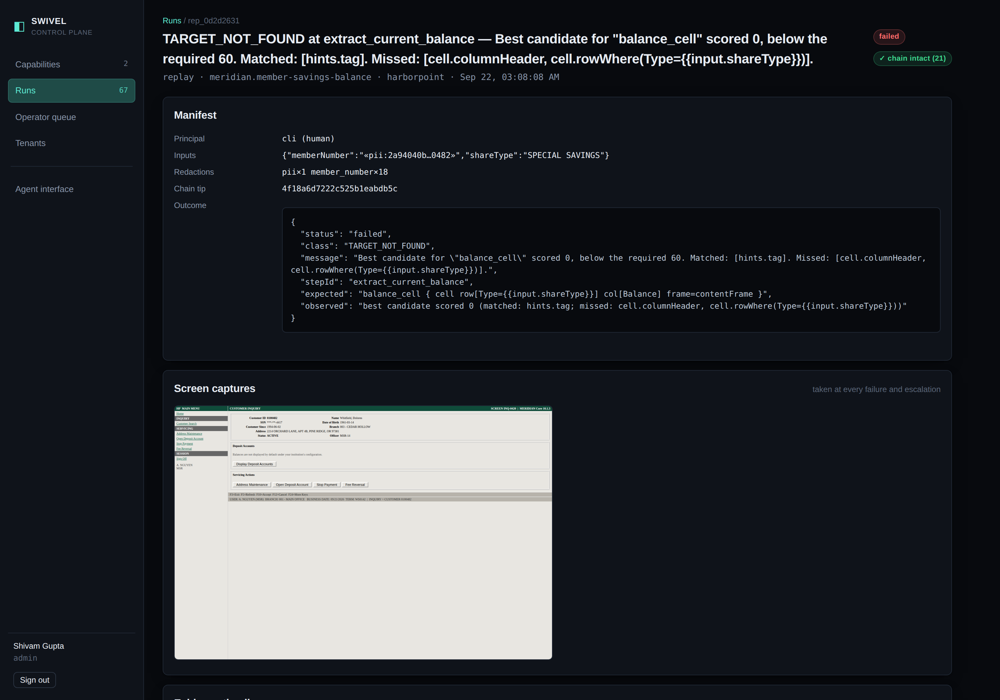
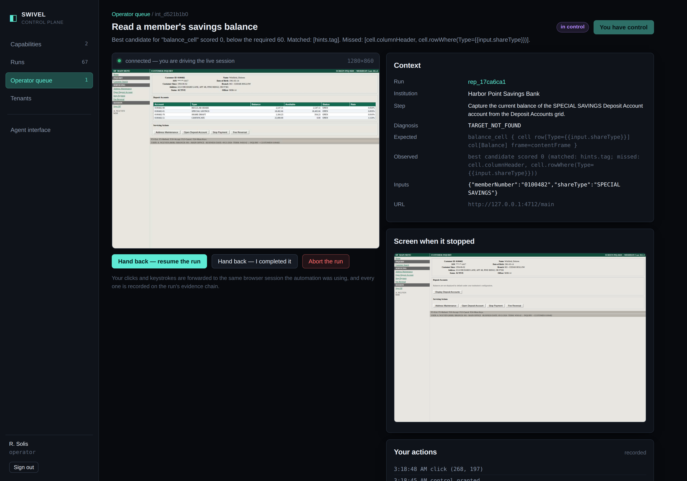
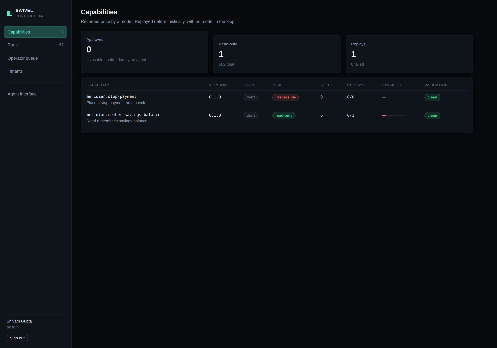

<div align="center">

# ◧ &nbsp;SWIVEL

### Computer-use capabilities for systems that were never meant to be automated.

A model learns a job inside a legacy bank application **once**.<br>
What it learns becomes a typed, versioned, reviewable capability that replays<br>
deterministically — and that an AI agent calls by name, for free, forever.

<br>

`discovery: 1 model run` &nbsp;·&nbsp; `replay: ~4.7s, 0 model calls` &nbsp;·&nbsp; `5/5 identical outcomes`

</div>

---

## Why this shape

Banks and credit unions run back-office software with no usable API: green
screens, 1990s server-rendered web apps, thick clients. The only way in is to
drive the UI the way a person does. The obvious answer — point a computer-use
model at the screen every time — does not survive contact with the domain:

- **It is not reproducible.** Frontier models now beat the human baseline on
  OSWorld and still fail roughly one task in six. A 17% failure rate on an
  unattended general-ledger posting is not a product.
- **It is not affordable.** Dozens of model round-trips per transaction, times
  thousands of items a day.
- **It is not auditable.** SR 11-7 requires the *institution* to perform its own
  outcomes testing on a vendor's model.

> **You cannot outcomes-test a system that does not produce the same output twice.**

So Swivel puts the model where it is genuinely good — reading an unfamiliar
screen once and working out what a trained operator would do — and takes it out
of the path where determinism is the requirement.

```
  the model discovers  →  the artifact is the capability  →  replay is how it runs in production
```

---

## What is in this repository

| | |
|---|---|
| **MERIDIAN Core** | A deliberately hostile simulation of a legacy core banking system. Framesets, four-deep layout tables, `<font>` tags, `__VIEWSTATE`, generated control ids, **and almost no `<label for>`** — so `getByLabel()` genuinely does not work. Ships as **two institutions on the same vendor product** at different versions, with different vocabulary, different control ids, an extra grid column and an extra screen. Every exceptional state is injectable on demand. |
| **The engine** | Perception seam, target resolver, deterministic replay, signal/recovery model, policy, redaction, hash-chained evidence, control lease, live operator takeover. |
| **The console** | Capability catalogue, review and approval, run evidence, and an operator console that takes over a stuck run's **live browser session**. |
| **The agent interface** | Approved capabilities compiled into MCP tools an AI agent can list and invoke. |

Nothing is simulated except the bank. The browser, the model run, the replays,
the escalation and the evidence are all real.

---

## Quick start

```bash
npm install                       # no browser download needed if one is already present
npm run setup                     # writes swivel.config.json and seeds the console

# terminal 1 — the legacy core (two institutions)
npm run meridian

# terminal 2 — the control plane
npm run console                   # → http://127.0.0.1:4700   (shivam / swivel)

# terminal 3 — the demonstration
npm run demo
```

`npm run demo` replays saved capabilities through every path that matters: the
happy path, each class of runtime exception, the safety refusals, five
consecutive runs for determinism, and the same artifact against a second
institution. **It never calls a model.**

<details>
<summary>Browser setup, if Playwright has no Chromium</summary>

```bash
npx playwright install chromium
# or point at one you already have:
export SWIVEL_CHROMIUM_PATH=/path/to/chrome
```
</details>

---

## The demo path

### 1 · Discovery — a model drives a live legacy UI, once

```bash
export SWIVEL_CRED_MERIDIAN_OPERATOR_ID=msr01     # credentials resolve from a secret
export SWIVEL_CRED_MERIDIAN_PASSWORD=meridian     # store; they never enter an artifact
export OPENAI_API_KEY=sk-...                      # or ANTHROPIC_API_KEY, or --llm claude-cli

npx swivel discover \
  --goal "Look up member 0100482 and report the current balance and the available balance of their SPECIAL SAVINGS share account." \
  --id meridian.member-savings-balance \
  --title "Read a member's savings balance" \
  --tenant pineridge \
  --param memberNumber=0100482 \
  --param "shareType=SPECIAL SAVINGS" \
  --param-spec "memberNumber=string|The credit union member number, 7 digits|pii|^[0-9]{7}$" \
  --param-spec "shareType=string|The share product to read, exactly as the core displays it|internal"
```

The model picks controls; Swivel decides how they are described, what proves each
step worked, and how risky it was. Values matching a declared parameter are
turned into `{{input.*}}` automatically, and words matching the institution's
vocabulary into `{{vocab.*}}` — which is what lets one artifact serve many banks.

**Three providers, one interface.** `--llm openai` (GPT-5.1 by default),
`--llm anthropic` (Claude Opus 5), or `--llm claude-cli`, which routes through a
locally signed-in Claude Code CLI and needs no key at all. The agent loop cannot
tell them apart, which is the point rather than an accident: *which* vendor's
model read the screen is a fact about one discovery run, not a property of the
capability it produced.

The evidence in this repository was recorded with **`gpt-5.1`**, because it
reports token usage and the CLI does not — and a discovery run that cannot state
its own cost is a weaker piece of evidence:

```
  model       openai/gpt-5.1
  model turns 7
  tokens      14488 in / 931 out / 20864 cached
  discovery cost  $0.0300
```

Three cents, once, for a capability that then replays for nothing. The cached
figure is the system prompt and tool schemas being resent every turn and billed
at a tenth — which is why caching is on the system prefix rather than
decoration.

### 2 · Replay — deterministic, no model

```bash
npx swivel replay meridian.member-savings-balance --tenant pineridge \
  --input memberNumber=0100482 --input "shareType=SPECIAL SAVINGS"
```

```
 SUCCESS   4596ms · 6 steps · quality 100/100
   outputs: {"currentBalance":18402.66,"availableBalance":18402.66}
```

### 3 · Exceptional states, on demand

```bash
--inject session-expiry-midflow   # re-authenticates, restarts safely, succeeds
--inject transient-error          # 503s from the app server
--inject eod-lockout              # → SYSTEM_UNAVAILABLE_EOD (retryable)
--inject record-locked            # retries ×3 → RECORD_LOCKED
--inject compliance-notice        # BSA/OFAC interstitial
--inject permission-denied        # → NOT_AUTHORIZED
--inject slow                     # 1.2s added to every request
```

### 4 · Safety

```bash
# An irreversible capability refuses to start without an explicit token —
# in 4ms, before a browser is opened.
npx swivel replay meridian.stop-payment --tenant pineridge \
  --input memberNumber=0100482 --input checkNumber=1042 --input amount=412.50

# With a change ticket as the confirmation token, as a supervisor:
SWIVEL_CRED_MERIDIAN_OPERATOR_ID=sup02 npx swivel replay meridian.stop-payment \
  --tenant pineridge --input memberNumber=0100482 --input checkNumber=1042 \
  --input amount=412.50 --confirm "change-ticket-CHG-4471"
```

<div align="center">

<br><sub>A failure, fully diagnosed — which step, which evidence matched, which went missing. The member number appears only as a salted hash.</sub>
</div>

### 5 · Escalation — a human takes over the live session

With the console running, replay the Pine Ridge capability against the *other*
institution with its overlay suppressed:

```bash
npx swivel replay meridian.member-savings-balance --tenant harborpoint \
  --no-overlay --console-url http://127.0.0.1:4700 \
  --input memberNumber=0100482 --input "shareType=SPECIAL SAVINGS"
```

`--no-overlay` is the control experiment for the multi-tenant claim, not a
debugging switch. This build of the same vendor product ships the deposit-account
balances collapsed behind a Display control, and the base artifact has no step
for it. The engine gets four steps in, finds no cell it can identify with
confidence, and **refuses rather than reading whichever cell is nearest** —
which is the behaviour the whole targeting model exists for, and the reason the
overlay is worth one patch.

Then it pauses and prints a URL. Open it: the operator console shows a **live
screencast of the paused browser session**, and clicks and keystrokes are
forwarded to it. Do the step by hand, hand control back, and the run resumes —
with everything you did on the run's evidence chain.

What it reports afterwards depends on what you actually did. Unblock read-only
work and hand back `resume`, and the automation genuinely finished the job:
`success`, with the escalation and your click on the record. Tell it you
finished the job yourself, and it reports `escalated` with `outputs: null`,
because the automation will not put a person's work on its own record.

`scripts/operator-rescue.mjs` does all of that through the same API and the same
websocket, if you would rather watch it than click it.

<div align="center">

<br><sub>Not a screenshot of a ticket. The operator's click has just used the Display control the base artifact has no step for — compare the live view, top left, with “Screen when it stopped” on the right.</sub>
</div>

### 6 · The agent interface

```bash
npx swivel approve meridian.member-savings-balance@0.1.0 --as reviewer
npx swivel catalog
```

Or over MCP, from Claude Code or Claude Desktop:

```jsonc
{
  "mcpServers": {
    "swivel": {
      "command": "npx",
      "args": ["tsx", "packages/mcp/src/main.ts"],
      "env": {
        "SWIVEL_CONSOLE_URL": "http://127.0.0.1:4700",
        "SWIVEL_API_USER": "shivam",
        "SWIVEL_API_PASSWORD": "swivel"
      }
    }
  }
}
```

Only **approved** capabilities are listed. Irreversible ones require a
`confirmationToken` the model cannot mint for itself. Business outcomes come back
as normal results so the agent branches instead of retrying.

---

<div align="center">

</div>

## How it works

```
                    ┌────────────── discovery (a model, once) ───────────────┐
  goal + params ──▶ │  observe ──▶ decide ──▶ act                            │
                    │     ▲                     │   model: WHICH control     │
                    │     └─────────────────────┘   Swivel: how it's         │
                    └──────────────┬───────────────  described, proven, rated┘
                                   ▼
                    ╔═══════════════════════════════════╗
                    ║  CAP-1 artifact + TenantOverlay   ║
                    ╚═══════════════╤═══════════════════╝
                                    ▼
  AI agent ──MCP/HTTP──▶ ┌──────────────────┐ ──▶ typed outputs
                         │  replay engine   │ ──▶ business outcome
                         │  0 model calls   │ ──▶ failure + evidence
                         └────────┬─────────┘ ──▶ escalation → live takeover
                                  ▼
                         ┌──────────────────┐
                         │  Surface (seam)  │  web · desktop (UIA/AX) · terminal
                         └──────────────────┘
```

**Controls are not identified by selectors.** A generated id like
`ctl00_Main_grdResults_ctl03_lnkView` encodes a row's position at record time and
differs between builds of the same product. What is stable is what a human uses:
role, accessible name, the caption beside it, the grid row it is in. A target is
a **bundle of independent evidence**, scored at replay time; below threshold or
too close to call, the engine **refuses rather than guessing** — and says which
evidence went missing, which is also the earliest available drift signal.

Full reasoning, trade-offs and limits: **[REPORT.md](REPORT.md)**.

---

## Commands

| | |
|---|---|
| `swivel discover` | Drive a live application with a model and record a capability |
| &nbsp;&nbsp;`--llm openai\|anthropic\|claude-cli` | Which model drives it. Defaults to whichever API key is set. |
| `swivel replay <id>` | Execute a saved capability. No model in the loop. |
| `swivel stability <id> --runs N` | Replay N times and report a flakiness signal |
| `swivel list` / `show <id>` | The catalogue; the full contract, flow, signals and validation |
| `swivel approve <id>@<v>` | Move a capability to approved so agents may invoke it unattended |
| `swivel catalog` | The agent-facing tool catalogue |
| `swivel codegen <id>` | Emit a runnable Playwright test from an artifact |
| `node scripts/compare-artifacts.mjs a b` | Diff two artifacts on the parts that decide behaviour |
| `swivel overlay new\|check <id>` | Scaffold and validate a tenant overlay |
| `swivel verify <runId>` | Re-verify an evidence bundle's hash chain |
| `swivel serve` / `meridian` | The console; the simulated core |

---

## Repository layout

```
packages/core/          the engine
  artifact/             CAP-1 schema, targeting, templating, hashing, validation, overlays
  surface/              the perception/action seam + the Playwright web surface
  targeting/            deterministic scored resolution
  agent/                discovery loop, screen digest, descriptor synthesis, LLM providers
  replay/               the deterministic engine, assertions, result contract
  signals/              per-product signal profiles (session expiry, EOD, locks, …)
  policy/ redact/ evidence/ escalation/ session/ store/ runtime/
packages/cli/           the swivel CLI
packages/mcp/           MCP server exposing approved capabilities as tools
apps/meridian/          the simulated legacy core (two institutions)
apps/console/           control plane + operator takeover console
evidence/               discovery and replay bundles, artifacts, transcripts
tests/                  110 tests, no browser required
```

---

## Testing

```bash
npm test          # 110 tests
npm run typecheck # strict TypeScript, no errors
```

The resolver, the error taxonomy, the policy engine, the control lease and the
evidence chain are all tested against synthetic screens with no browser, no
server and no model. That is not a testing convenience — it is the evidence that
the perception seam is real, and it is what makes a desktop surface an
implementation of two methods rather than a second system.

---

## Evidence

[`/evidence`](evidence/) contains the capability artifacts, the discovery run
that produced them (including the redacted model transcript), and replay bundles
covering success, a business outcome, a recovery and a failure. Every bundle is
hash-chained; `swivel verify` re-checks it.

---

<div align="center">
<sub>Built by <b>Shivam Gupta</b> · <a href="REPORT.md">design write-up</a> · all data in this repository is synthetic</sub>
</div>
