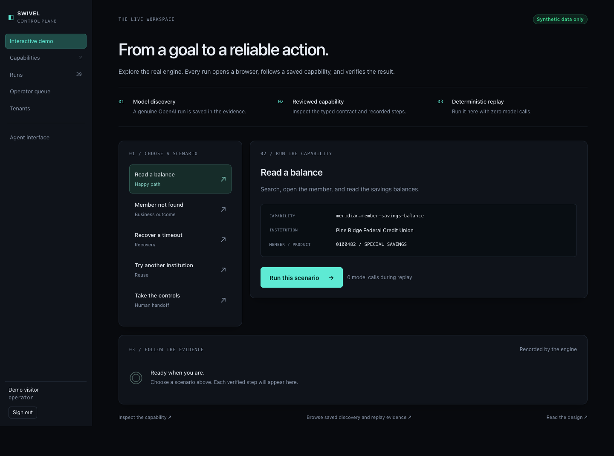

# Swivel

**Learn a job once. Replay it with confidence.**

Swivel lets an AI discover how to operate a legacy application, then saves the job as a typed, versioned capability. Subsequent runs use deterministic browser automation, with explicit outcomes, bounded recovery, policy checks, and a real human takeover path.

[Open the live demo](https://swivel-demo.web.app) · [Watch the captioned demo](docs/demo/swivel-demo.mp4) · [Design report](REPORT.md) · [Verified evidence](evidence/verified/README.md)

The bank is a simulator. The browser interactions, model discovery, replay, and session handoff are real. All member records and credentials in the demo are synthetic.



## Try it in the browser

Open **https://swivel-demo.web.app** and select **Open interactive demo**. No signup or API key is needed.

1. **Read a balance:** a real Chromium browser signs in, searches, opens the member, and extracts two balances.
2. **Member not found:** a known business outcome is returned instead of a crash.
3. **Recover a timeout:** a session expires mid-flow; the engine re-authenticates and safely restarts.
4. **Try another institution:** the base capability runs against a second version using a small overlay.
5. **Take the controls:** the run stops at a missing step. Open the live session, claim it, click **Display Deposit Accounts** in the bank screen, and select **Resume automation**. The same browser session continues.

Each run links to its structured evidence. Browse **Capabilities** for inputs, outputs, targeting rationale, steps, signals, and the raw artifact. **Runs** includes saved discovery evidence.

The public sandbox runs one scenario at a time. New runs are ephemeral and reset when the demo instance is replaced. Model discovery and custom invocations are available through the local CLI; the hosted replay demo does not hold a model API key.

## Local setup

Requires Node.js 20.10 or newer and Chromium. The checked-in lockfile makes dependency installation reproducible.

```bash
npm ci
npm run setup

# Use an installed Chrome binary, for example on macOS:
export SWIVEL_CHROMIUM_PATH="/Applications/Google Chrome.app/Contents/MacOS/Google Chrome"
# Or install the matching browser:
npx playwright-core install chromium

# Starts both synthetic banks and the guided console in one process.
npm run hosted
# http://127.0.0.1:4700
```

For the full author/reviewer console, use separate terminals instead:

```bash
npm run meridian
npm run console
# Console: http://127.0.0.1:4700
# Local accounts: shivam / swivel, reviewer / swivel, operator / swivel
```

Do not run `hosted` and `meridian` simultaneously: both start the banks on ports 4711 and 4712. The local author console includes review, approval, and parameterized invocation. Set the simulator credentials in the console process before invoking:

```bash
export SWIVEL_CRED_MERIDIAN_OPERATOR_ID=msr01
export SWIVEL_CRED_MERIDIAN_PASSWORD=meridian
```

## Exact discovery and replay path

Start the synthetic banks first. Supply a real model key only in your shell environment. `.env.example` documents the options; the app does not automatically load `.env` files.

```bash
export OPENAI_API_KEY="your-key"
export SWIVEL_LLM_MODEL=gpt-5.1
export SWIVEL_CRED_MERIDIAN_OPERATOR_ID=msr01
export SWIVEL_CRED_MERIDIAN_PASSWORD=meridian

npm run swivel -- discover --llm openai \
  --goal "Look up the member given by memberNumber and report the current and available balance of the share account given by shareType." \
  --id meridian.my-savings --title "Read a member savings balance" \
  --tenant pineridge \
  --param memberNumber=0100482 --param "shareType=SPECIAL SAVINGS" \
  --param-spec 'memberNumber=string|Member number, 7 digits|pii|^[0-9]{7}$' \
  --param-spec 'shareType=string|Share product name|internal'

# The saved capability is imported automatically into the local store.
# Replay does not use OPENAI_API_KEY or call a model.
npm run swivel -- replay meridian.my-savings --tenant pineridge \
  --input memberNumber=0100482 --input "shareType=SPECIAL SAVINGS" --no-escalate
```

Discovery writes the artifact under `artifacts/` and a redacted evidence bundle under `evidence/runs/`. The saved verification artifact and both associated run IDs are indexed in [evidence/verified/README.md](evidence/verified/README.md).

Run the existing capability without any live model service:

```bash
npm run swivel -- replay meridian.member-savings-balance --tenant pineridge \
  --input memberNumber=0100482 --input "shareType=SPECIAL SAVINGS" --no-escalate

# Expected business outcome:
npm run swivel -- replay meridian.member-savings-balance --tenant pineridge \
  --input memberNumber=9999999 --input "shareType=SPECIAL SAVINGS" --no-escalate

# Recoverable condition:
npm run swivel -- replay meridian.member-savings-balance --tenant pineridge \
  --input memberNumber=0100482 --input "shareType=SPECIAL SAVINGS" \
  --inject session-expiry-midflow --no-escalate
```

`npm run demo` exercises the larger CLI matrix, including safety refusals, five consecutive replays, and tenant overlays. It is a demonstration script, not the automated acceptance gate. Run it serially with other simulator tests because injected scenarios affect the selected simulator instance.

## Live human handoff

The easiest path is **Take the controls** in the guided demo. To reproduce it with the full local console:

```bash
npm run swivel -- replay meridian.member-savings-balance --tenant harborpoint \
  --no-overlay --console-url http://127.0.0.1:4700 \
  --input memberNumber=0100482 --input "shareType=SPECIAL SAVINGS"
```

Sign in as `operator / swivel`. Claim the intervention, operate the live bank screen, and return control. Only the claimant can obtain the live session token. A control lease prevents automation and the operator from driving concurrently. A human completion reports `escalated`, while a successful automation resume reports `success` with the intervention in its evidence.

`scripts/operator-rescue.mjs` is a scripted stand-in for the operator for repeatable local demonstrations. It uses the same API and WebSocket as the console, and its actions are recorded as such.

## Validate

```bash
npm run typecheck
npm test

# Visual browser checks, using SWIVEL_CHROMIUM_PATH if needed:
npm run test:ui

# Live screen, reconnect, and keyboard hand-back:
node scripts/check-handoff-ui.mjs

# Against a running `npm run hosted`:
node scripts/check-demo.mjs

# Against the deployed service:
SWIVEL_TEST_URL=https://swivel-demo.web.app node scripts/check-demo.mjs

# Verify an evidence chain:
npm run swivel -- verify evidence/runs/rep_2ffe6dc9
```

The test suite covers artifact validation, targeting ambiguity, policy, redaction, recovery, output contracts, control leases, console authorization, and the hosted sandbox boundaries. The acceptance script checks all five scenarios, including a real screencast, a click sent to the paused browser, and the final evidence chain. Responsive browser checks cover 1440, 768, and 390 pixel viewports.

## Deployment

Firebase Hosting serves the UI at a clean `web.app` address and rewrites `/api/**` to Cloud Run. The backend image includes Chromium and both loopback-only simulators. Live operator WebSockets connect directly to the Cloud Run TLS endpoint.

```bash
# Requires an authenticated gcloud + Firebase CLI and a billing-enabled project.
# Enable Cloud Run, Cloud Build, Artifact Registry, and Firebase Hosting first.
# Create your Hosting site and adjust firebase.json's site/service if needed.
GCP_PROJECT=your-project bash scripts/deploy.sh
```

The current sandbox uses service `swivel` and Hosting site `swivel-demo` in an existing billing-enabled project. No model key is deployed. The instance limit and one-run guard keep the demonstration bounded. This is a review sandbox, not a production deployment for regulated data.

## Source map

| Path | Purpose |
| --- | --- |
| `packages/core/src/artifact` | Versioned contracts, validation, hashing, tenant overlays |
| `packages/core/src/agent` | Goal-driven model discovery and artifact synthesis |
| `packages/core/src/replay` | Deterministic execution, outcomes, assertions, recovery |
| `packages/core/src/surface` | Perception/action abstraction and browser adapter |
| `packages/core/src/escalation` | Intervention broker, control lease, live input channel |
| `apps/meridian` | Legacy banking simulator with two institutions |
| `apps/console` | Reviewer and operator console, guided demo |
| `packages/mcp` | Agent-facing capability tools |
| `evidence` | Artifacts, discovery and replay logs, failure captures |

See [REPORT.md](REPORT.md) for the seven requested design sections, limitations, and next steps.
